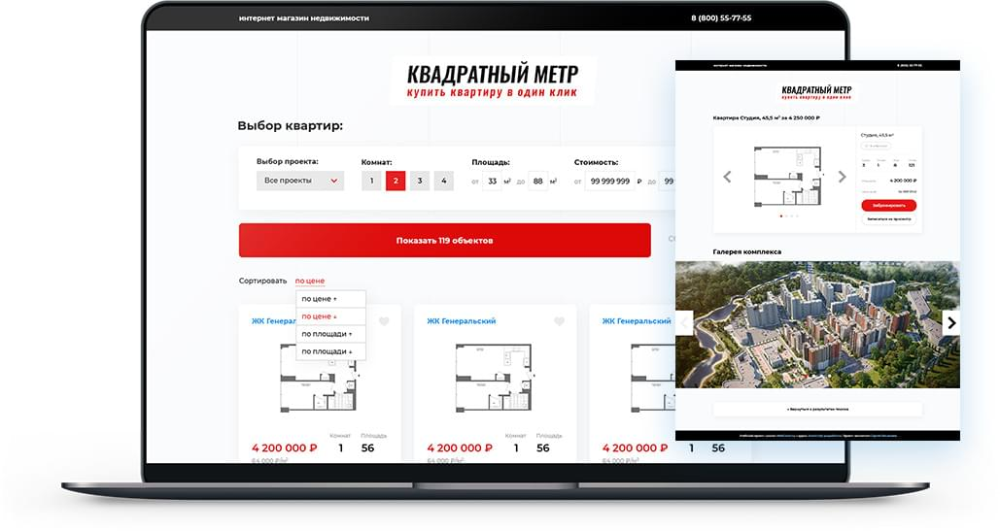

# Интернет-магазин недвижимости

	

### Доступные команды

* `npm install` - установить зависимости
* `npm run start` - запустить встроенный сервер и следить за изменениями файлов
* `npm run build` - собрать проект в папку `dist` в режиме production
* `npm run dev` - собрать проект в папку `dist` в режиме development 

### Функционал

* Получение данных через API
* Сортировка и фильтрация по различным параметрам
* Добавление и удаление из избранного
* Отправка заявок
* Пагинация
* Навигация hash

### Особенности

* Native js
* SPA приложение
* MVC архитектура проекта
* Компонентный подход
* реализация на модулях ES6
* Работа с API.
* Работа с localStorage
* Класс Event Emitter для генерации пользовательских событий
